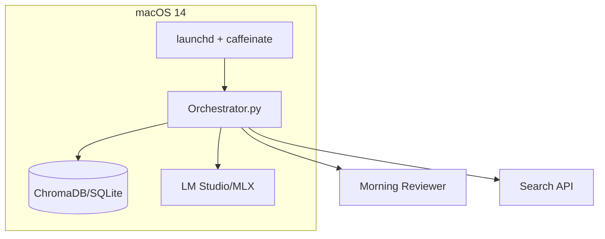

# ResearchBot

An autonomous overnight research utility that runs on local LLMs, designed for macOS (Apple Silicon).

## Features

- 🕒 Scheduled overnight execution via `launchd`
- 🔍 Web research with DuckDuckGo/SerpAPI
- 🧠 Local LLM inference via LM Studio (MLX) or remote Ollama
- 💾 Persistent storage with ChromaDB
- 🔄 Resumable research sessions
- 📊 Mermaid.js diagrams for visualization

## System Requirements

- macOS 14.x on Apple Silicon (M3 Pro, 36GB RAM recommended)
- Python ≥ 3.11
- LM Studio (for local MLX inference) or Ollama server (for remote)
- 10GB free disk space for models and data

## Installation

1. **Clone the repository**
   ```bash
   git clone <repository-url>
   cd researchbot
   ```

2. **Set up virtual environment**
   ```bash
   python -m venv venv
   source venv/bin/activate
   ```

3. **Install dependencies**
   ```bash
   pip install -r requirements.txt
   ```

4. **Set up environment variables**
   Create a `.env` file:
   ```env
   # Required
   RESEARCH_TOPIC="Your default research topic"
   
   # Optional overrides
   USE_LMSTUDIO=1  # Set to 0 to use mlx-lm directly
   MODEL="phi-3-mini"  # Default model
   OPENAI_BASE_URL=""  # Set to Ollama server if using remote
   ```

5. **Download models**
   - For LM Studio: Download and load your preferred model (see [Model Configuration](#model-configuration))
   - For Ollama: `ollama pull phi3:mini`

## Model Configuration

### Supported Models

| Model | Parameters | Quantization | RAM Usage | Tokens/s (M3 Pro) |
|-------|------------|--------------|-----------|-------------------|
| phi-3-mini | 3.8B | Q4_K_M | ~4GB | ~25 |
| gemma-7b-it | 7B | Q4 | ~6GB | ~16-18 |
| mistral-7b-instruct | 7B | Q4 | ~6GB | ~15 |

### Recommended Settings
- Context window: 4096 tokens
- Temperature: 0.7
- Top-p: 0.9

## Usage

### Manual Execution
```bash
python src/orchestrator.py "Your research topic"
```

### Scheduled Execution
1. Copy the launchd plist to your LaunchAgents directory:
   ```bash
   cp config/com.user.researchbot.plist ~/Library/LaunchAgents/
   ```

2. Load the service:
   ```bash
   launchctl load ~/Library/LaunchAgents/com.user.researchbot.plist
   ```

## System Architecture



## Data Storage

- **Research Data**: `~/ai/chromadb_store`
- **Logs**: `~/logs/research.log`
- **Error Logs**: `~/logs/research.err`

## Development

### Code Style
- Black-formatted code
- Type hints (PEP 484)
- Async/await for I/O operations

### Testing
```bash
# Run smoke test
python tests/smoke_test.py

# Run full test suite
pytest tests/
```

## Troubleshooting

### Common Issues
1. **LM Studio not responding**
   - Ensure LM Studio is running with the MLX engine enabled
   - Check that the API server is enabled in LM Studio settings

2. **Out of memory**
   - Try a smaller model
   - Reduce batch size in configuration
   - Close other memory-intensive applications

3. **Search API failures**
   - Check internet connection
   - Verify API keys if using a paid search service

## License

Apache 2.0

## Acknowledgements

- LM Studio for the MLX inference engine
- Chroma for vector storage
- Ollama for model serving
- Mermaid.js for diagrams
